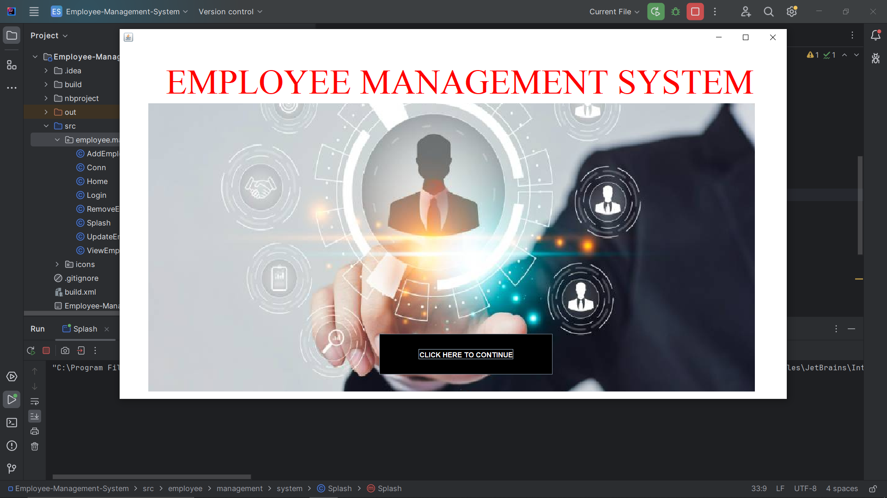
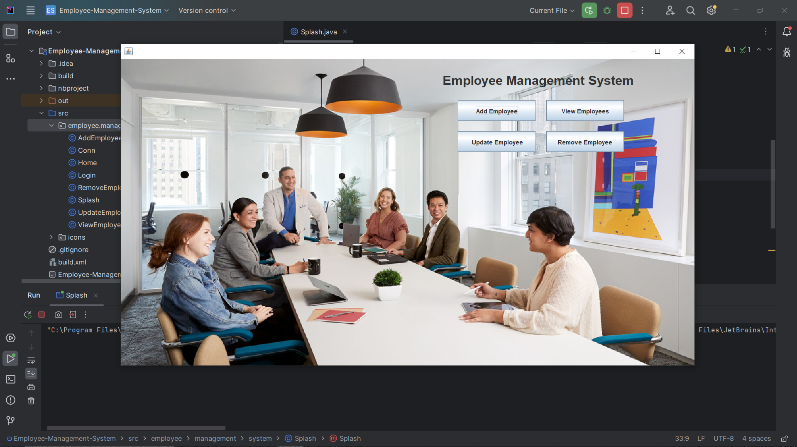
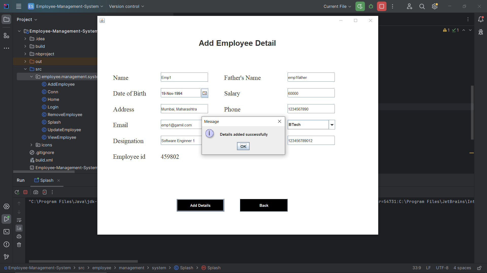
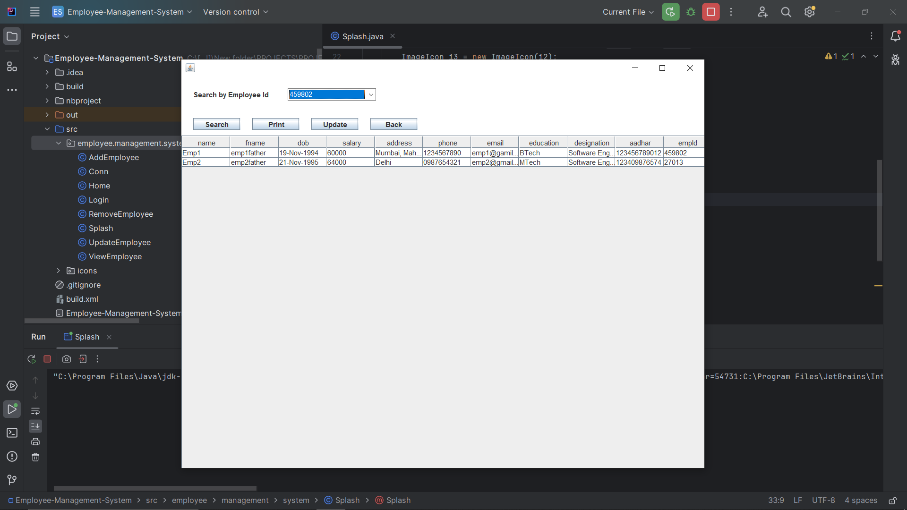

# Employee Management System

A comprehensive desktop application using Java Swing, AWT to manage employee information efficiently. The system includes functionalities to add, update, view, and delete employee records, providing a user-friendly interface for streamlined HR operations and maintaining a centralized database for data consistency.  

Technologies Used:
  1. Java Swing, AWT 
Created in IntelliJ IDEA Community Edition IDE

Screenshots:

    

        
        
    

    

        
        
    

 
